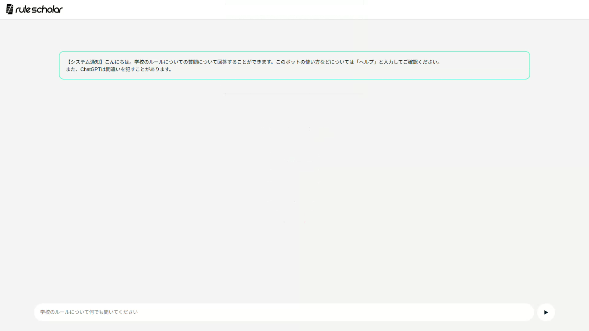

# RuleScholar

## 概要
RuleScholar（ルールスカラー）は、学校のルールに関する質問をデータベースから検索し、ChatGPTのAPIを利用して回答するシステムです。このプロジェクトは3ヶ月間かけて開発されました。

学校には多くのルールが存在し、生徒が全てを覚えることは困難です。RuleScholarは、適宜質問できるチャットボットサービスとして設計されましたが、公開が難しい状況となったため、オープンソース化することにしました。

あくまでこのコードは、ChatGPTによる生成とLinuxが少しできる一般人によるコーディングの賜物であるため、本業としている人にとっては見がたいコードかもしれないことを事前にお伝えしておきます。

## ディレクトリ構成

RuleScholarは以下の2つの主要なディレクトリに分かれています。

1. **ディレクトリA**: Python実行ファイルおよびserviceファイルが含まれています。
   - パス: `home/example/server`（venv名は `server` ）
   - **ポイント**: serviceファイルは常駐サーバー化のために使用します。必要に応じてこれを適切にsystemctlに配置してください。

2. **ディレクトリB**: Apacheサーバー直下のディレクトリ。
   - パス: `/var/www/html`

## 使用環境とツール

RuleScholarの動作には以下の環境およびツールが必要です。

- **OS**: Ubuntu 22.04 LTS
- **Webサーバー**: Apache
- **バックエンドフレームワーク**: FastAPI
- **仮想環境**: venv
- **メール送信**: Gmail（Googleアプリパスワード使用）
- **ログ管理**: Discord

## アーキテクチャ解説

（現在準備中です。今後のアップデートをお待ちください。）

## ライセンス

RuleScholarはオープンソース精神に基づき、ロゴ、コードを含むすべてのコンテンツを自由に利用できます。
